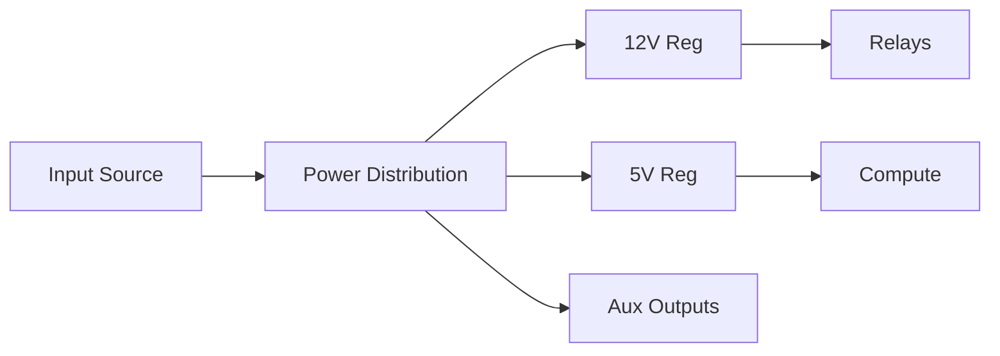

# Power Flow

Document how power enters, is regulated, and is distributed.

```mermaid
flowchart LR
  Source[Input Source] --> PD[Power Distribution]
  PD --> Reg12[12V Reg]
  PD --> Reg5[5V Reg]
  Reg12 --> Relays
  Reg5 --> Compute
  PD --> Aux[Aux Outputs]
```

Include current limits, fuse ratings, and protection notes alongside the diagram.

