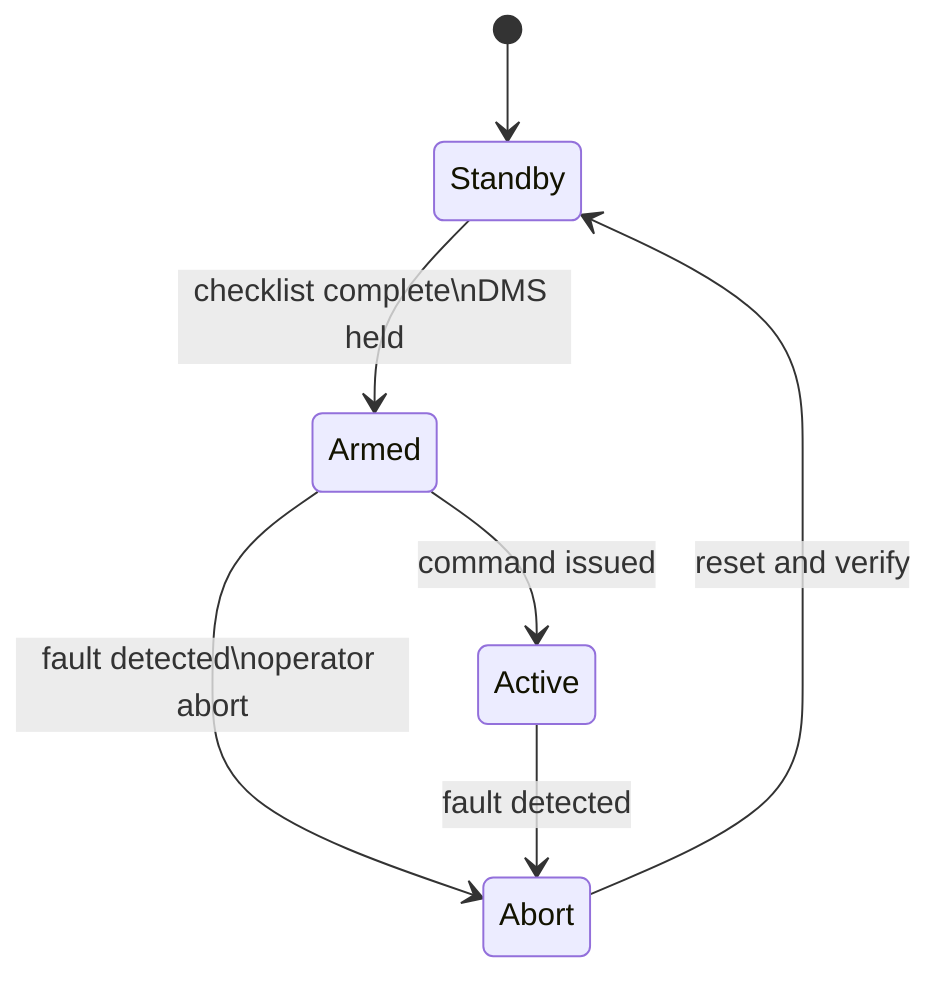

# Safety State Machine

Capture the safety/arming states and transitions.

```mermaid
stateDiagram-v2
  [*] --> Standby
  Standby --> Armed : checklist complete\nDMS held
  Armed --> Abort : fault detected\noperator abort
  Armed --> Active : command issued
  Active --> Abort : fault detected
  Abort --> Standby : reset and verify
```

Align this with `safety/interlocks.md` and operational checklists.

