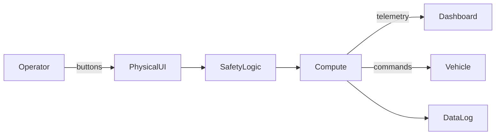

# System Block Diagram

Maintain an up-to-date high-level block diagram of the groundstation.

```mermaid
flowchart LR
  Operator -->|buttons| PhysicalUI
  PhysicalUI --> SafetyLogic
  SafetyLogic --> Compute
  Compute -->|telemetry| Dashboard
  Compute -->|commands| Vehicle
  Compute --> DataLog
```

Replace with the authoritative diagram used in design reviews.

